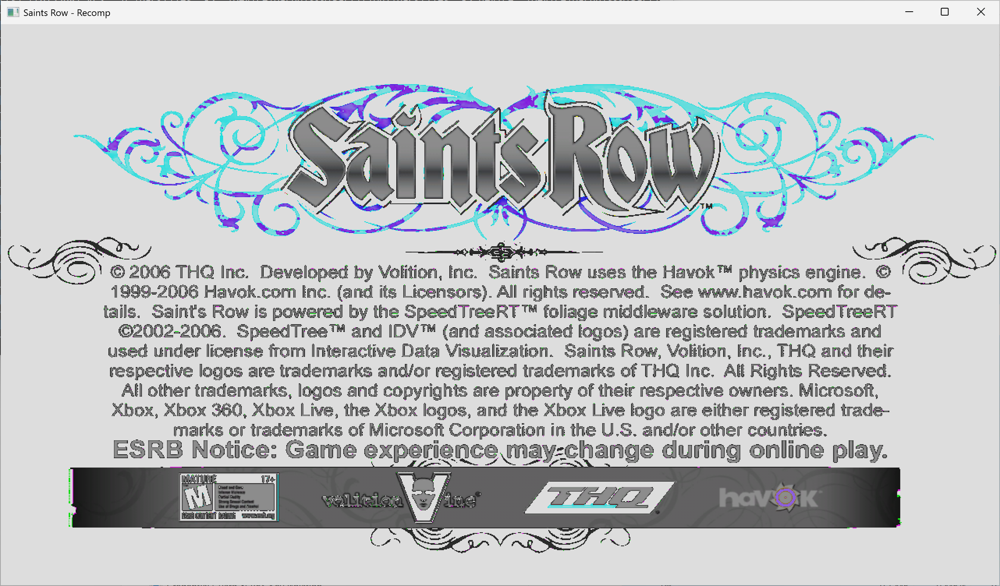

# Saints Row (Xbox 360, 2006) - Static Recompilation

**Status: 3D Rendering Active -- Cathedral and Loading Screen Visible**



Static recompilation of Saints Row for Xbox 360 to native x86-64 PC executable using [XenonRecomp](https://github.com/hedge-dev/XenonRecomp) and [ReXGlue SDK](https://github.com/rexglue/rexglue-sdk).

Saints Row (2006) was an Xbox 360 exclusive and has never been ported to PC, making it a compelling preservation target.

## Background

This project uses the same toolchain proven across multiple Xbox 360 titles:
- [360tools](https://github.com/sp00nznet/360tools) -- Extraction, analysis, and project templates
- [XenonRecomp](https://github.com/hedge-dev/XenonRecomp) -- PowerPC to C++ static recompiler
- [ReXGlue SDK](https://github.com/rexglue/rexglue-sdk) -- Xbox 360 runtime (kernel, D3D12 GPU, audio, input)

## Project Complexity

Saints Row is a large open-world game -- significantly more complex than the arcade ports and smaller titles that have been successfully recompiled so far. Key challenges:

- **Scale**: Large PE image with tens of thousands of functions
- **Open world**: Streaming world data, LOD systems, AI systems
- **Physics**: Havok physics engine integration
- **Audio**: Complex multi-channel audio with environmental effects
- **Networking**: Xbox Live stubs needed for save/profile systems

## Pipeline

```
Saints Row.iso
    |
    v
[ extract_iso.py ]          -- Extract game files from XDVDFS disc image
    |
    v
[ extract_pe.py ]           -- Decrypt XEX2 + decompress PE image
    |
    v
[ find_abi_addrs.py ]       -- Locate PPC ABI helpers
[ extract_switch_tables.py ] -- Map jump tables
[ xex_info.py ]             -- Analyze XEX2 headers
[ parse_xex_imports.py ]    -- Identify kernel/XAM imports
    |
    v
[ XenonRecomp ]             -- PowerPC -> C++ static recompilation
    |
    v
[ ReXGlue SDK ]             -- Xbox 360 runtime environment
    |
    v
Native x86-64 .exe          -- Saints Row on PC
```

## Progress

- [x] Acquire game ISO
- [x] Extract ISO contents (375 files from XGD2 disc)
- [x] Extract and analyze XEX2 binary (33.4 MB PE, 12 sections, Bink middleware)
- [x] Find ABI helper addresses (8/10 found, no setjmp/longjmp)
- [x] Analyze kernel imports (266 kernel + 204 XAM)
- [x] Run XenonRecomp first pass (33,725 functions -> 122 MB C++)
- [x] Resolve unrecognized instructions (vandc, mulhdu, frsqrte, dcbst)
- [x] Create project scaffold (CMake + ReXGlue SDK v0.7.0)
- [x] First compilation (45 MB native x86-64 executable)
- [x] First boot -- game entry point executes, loads all packfiles
- [x] D3D12 GPU initialization (NVIDIA RTX 5070, ROV, tier 3)
- [x] Audio system (XMA decoder + SDL audio)
- [x] Game creates 14+ worker threads (physics, streaming, etc.)
- [x] Bink video decode -- both splash videos decode and audio plays
- [x] Game state machine -- transitions through all loading phases (state 1 -> 2 -> 3)
- [x] Content loading system -- all 151 items loaded (~30-60 seconds)
- [x] VdSwap/IssueSwap -- frames present to D3D12 swap chain
- [x] GPU ring buffer pipeline -- PM4 indirect buffers with circular wrap
- [x] GPU command processor -- processes 4500+ kicks, executes draw calls
- [x] Shader compilation -- 9 shaders, 5 graphics pipelines (including 3D game rendering)
- [x] Render targets created (1280x2048 color + depth at EDRAM base 0/720)
- [x] D3D12 presenter connected to window
- [x] **3D game content visible** -- Saints Row logo, cathedral, loading screen rendered
- [x] Game loop stable at 1700+ frames
- [ ] Fix presentation flicker (VdSwap timing)
- [ ] Fix color channel swizzle on 3D scene
- [ ] Input system (controller navigation)
- [ ] Menu navigation
- [ ] In-game rendering
- [ ] Gameplay

### Current Architecture

The game boots through Bink video playback (THQ/Volition logos), then loads 151 content items via a streaming IO pipeline: StreamCallback -> IOComp -> ResLookup -> BufAlloc -> IORead -> IOWork. Loading uses KeInitializeSemaphore preservation to maintain IO thread synchronization across re-initialization cycles, with multi-pump StreamCallback (8x per GameUpdate) for parallel IO dispatch.

After loading, PostLoop5 runs the main game loop calling GL2_Render at ~30fps. The GPU command processor receives PM4 commands via the primary ring buffer (physical memory writes with circular wrap-around), follows INDIRECT_BUFFER_PFD references to secondary buffers containing draw calls, and compiles 5 graphics pipelines including 3 game-specific 3D rendering shader pairs with lighting and texture sampling.

### Key Technical Fixes

- **KeInitializeSemaphore override**: Preserves native semaphore objects when game reinitializes IO semaphores, preventing orphaned IO threads
- **Audio deadlock fix**: Skip XAudioRegisterRenderDriverClient on re-init (sub_82600A68 acquires global_critical_region_ held by audio callback)
- **Ring buffer physical memory**: Write INDIRECT_BUFFER_PFD to physical memory (not virtual) so command processor can read them
- **Ring buffer wrap-around**: Circular write position prevents game loop kicks from being silently dropped
- **Null page threshold**: Guest addresses < 256MB treated as null dereferences to prevent demand-page exhaustion
- **VEH ultra-fast path**: Handles bad vtable dispatches at fault_addr=0x8000001E without overhead

### Known Issues

- Presentation flicker (gray frames between valid presents, VdSwap timing)
- Color channel shift on 3D scene (logo colors correct, cathedral colors wrong)
- Second+ Bink videos blocked (garbage allocation crash)
- XamInput functions stubbed (input not connected)
- Physics/world systems stubbed (sub_8234C1C0, sub_82604C10)

## Related Projects

- [StilwaterReclaimed](https://github.com/THE-W0RLD/StilwaterReclaimed) -- Saints Row 2 static recompilation (early stage)
- [Halo 3 Recomp](https://github.com/twist84/halo3_cache_debug_recomp) -- Halo 3 cache debug recomp using ReXGlue SDK
- [OpenRow2](https://github.com/KairiFey/OpenRow2) -- Decompilation of the Saints Row 2 PC port
- [Xenia](https://github.com/xenia-project/xenia) -- Xbox 360 emulator with Saints Row compatibility info

## Prerequisites

- Python 3.8+ with `pycryptodome`
- CMake 3.25+, Ninja, Clang 18+ (clang-cl on Windows)
- MSVC 2022 (for Windows SDK headers)
- [360tools](https://github.com/sp00nznet/360tools)

## License

Tools and scripts in this repo are provided under the MIT License.
